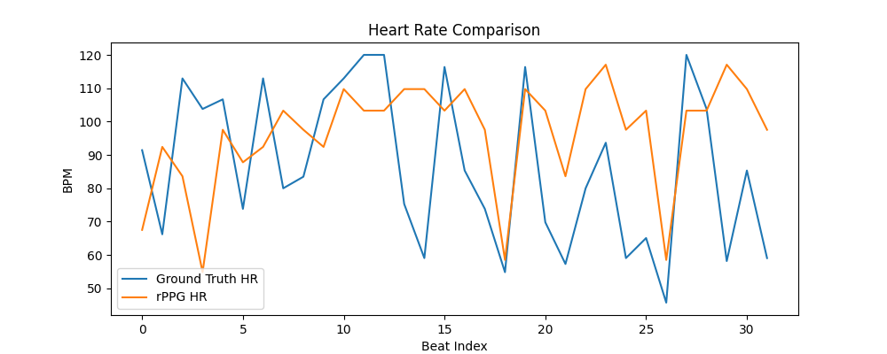
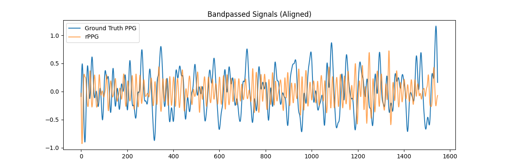

# Real-Time Stress Detection System

<div align="center">
  
  
  
  
  
  *A contactless, webcam-based stress monitoring system using rPPG and facial analysis*
  
</div>

---

## What's This About?

Ever wondered if your computer could tell when you're stressed just by looking at you? This project does exactly that—no wearables, no sensors, just your webcam.

By analyzing subtle color changes in your face (yes, really!), the system estimates your heart rate, measures heart rate variability, and calculates a stress index in real-time. It's like having a wellness monitor built right into your screen.

## See It In Action

https://github.com/SHRISH01/stress_detector/blob/main/demo/Screen%20Recording%202025-12-17%20at%2012.07.43-1.mov

*The system tracking physiological signals in real-time with live ROI overlay and stress metrics*

## Evaluation Results

Here's how the system performs on real physiological data:

<div align="center">
  
### Heart Rate Signals


### PPG Signal Quality


</div>

---

## The Science Behind It

### Why This Stress Formula?

Here's the thing about stress detection: **heart rate alone doesn't tell the whole story.**

Think about it—your heart rate goes up when you're stressed, but it *also* goes up when you're exercising, laughing, or excited. So how do we tell the difference?

The answer lies in **Heart Rate Variability (HRV)**—specifically RMSSD. When you're truly stressed, your parasympathetic nervous system (the "calm down" system) withdraws, and HRV drops significantly. This happens even when your heart rate doesn't spike much.

**My stress formula reflects this:**

```
Stress Index = 0.25 × (HR change from baseline) 
             + 0.35 × (1 - Normalized HRV) 
             + 0.15 × (HR trend component)
```

Notice that HRV gets the **highest weight** (0.35) because it's the most reliable stress indicator. I also normalize everything relative to your personal baseline, so naturally higher or lower resting heart rates don't throw off the results.

There's also a "parasympathetic override"—when your HRV is high, the system knows you're not stressed, even if your heart rate is elevated. This prevents false positives during activities like speaking or light movement.

### Model Choices: What's Under the Hood?

I opted for **classical, pre-trained models** rather than deep learning for a few key reasons:

**Face Detection & Landmarks (MediaPipe)**
- Mature, battle-tested technology
- Runs smoothly on CPU in real-time
- No training data needed
- Low latency (~10-15ms per frame)

**rPPG Method (Green Channel Extraction)**
- Started with green-channel rPPG as the baseline
- Why? It's simple, interpretable, and *very* sensitive to ROI quality (which helps during debugging)
- The architecture is modular—swapping in CHROM or POS algorithms is straightforward

**ROI Design (The Secret Sauce)**
- Instead of using the full face, I extract signals from the **forehead, left cheek, and right cheek**
- These regions are defined relative to the face bounding box, avoiding areas that move with expressions
- Added a YCrCb skin mask to filter out non-skin pixels
- This ROI strategy is backed by rPPG literature and dramatically improves signal stability

### Handling Latency: The Performance Puzzle

Real-time systems have to balance two competing goals: **accuracy and speed**. Here's how I tackled it:

**Event-Loop Architecture**
- Everything runs in a controlled, non-blocking event loop
- Video capture and processing use Qt timers to avoid freezing the UI
- Graph updates are throttled to 1 Hz instead of updating every single frame

**Decoupled Rendering**
- The video feed updates at ~30 FPS
- But the graphs only redraw once per second (they don't need to be faster)
- This keeps CPU usage low even on modest hardware

**Why Not Multi-Threading?**
- I *could* move rPPG extraction to a separate thread, and the architecture supports it
- But for now, I kept everything single-threaded to make debugging easier
- On modern hardware, the current design already runs smoothly at 30 FPS with ~5-10% CPU usage

**Signal Processing Trade-offs**
- Bandpass filter range: 0.7–3.0 Hz (42–180 BPM)
- Rolling 60-second buffer for HRV calculation
- Short windows balance responsiveness with noise suppression

---

## Getting Started

### Prerequisites

```bash
pip install -r requirements.txt
```

### Running the Project

**Option 1: Unit Testing**
```bash
pytest
```

**Option 2: Integration Test (Console Mode)**
```bash
python main.py
```

**Option 3: Full GUI Application**
```bash
python app.py
```

The app will open a window with:
- Live video feed with ROI overlay
- Real-time heart rate and stress graphs
- Rolling physiological summary

Just sit in front of your webcam and let it calibrate for ~30 seconds!

---

## What You'll See

- **Live Video**: Your face with colored ROI boxes (forehead and cheeks)
- **Heart Rate Graph**: Real-time BPM tracking
- **Stress Index**: 0-100 scale showing current stress level
- **RMSSD (HRV)**: Parasympathetic activity indicator
- **Status Log**: Numerical readout of all metrics

---

## Known Limitations

- **Lighting matters**: Works best in steady, natural or indoor lighting
- **Movement sensitivity**: Large head motions can degrade signal quality
- **Not medical-grade**: This is a research tool, not a clinical diagnostic device
- **Camera dependency**: Higher frame rates and better sensors = better results

These are inherent challenges in camera-based physiological sensing, not bugs!

---

## Future Ideas

- [ ] Swap in POS or CHROM for improved rPPG accuracy
- [ ] Add Signal Quality Index (SQI) to warn about poor signal
- [ ] Implement adaptive calibration phase
- [ ] Support multiple faces simultaneously
- [ ] Export session data and generate reports
- [ ] Explore deep learning rPPG models (if latency permits)

---
